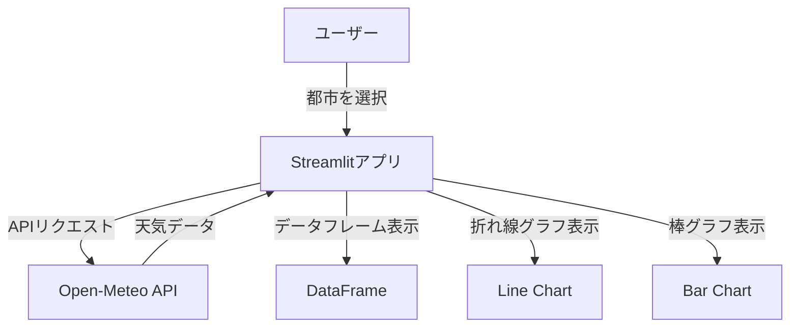
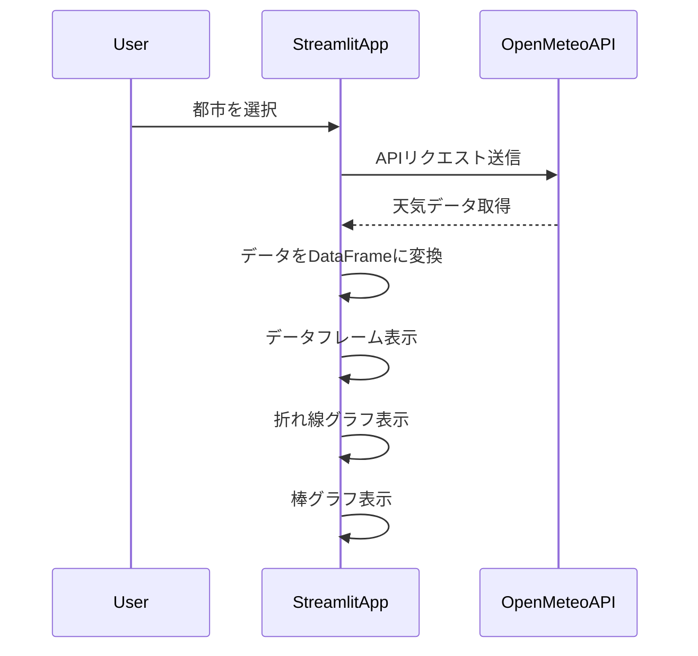

## 概要図

```mermaid
graph TD
    A[ユーザー] -->|都市を選択| B[Streamlitアプリ]
    B -->|APIリクエスト| C[Open-Meteo API]
    C -->|天気データ| B
    B -->|データフレーム表示| D[DataFrame]
    B -->|折れ線グラフ表示| E[Line Chart]
    B -->|棒グラフ表示| F[Bar Chart]
```

## シーケンス図

```mermaid
sequenceDiagram
    participant User
    participant StreamlitApp
    participant OpenMeteoAPI
    User ->> StreamlitApp: 都市を選択
    StreamlitApp ->> OpenMeteoAPI: APIリクエスト送信
    OpenMeteoAPI -->> StreamlitApp: 天気データ取得
    StreamlitApp ->> StreamlitApp: データをDataFrameに変換
    StreamlitApp ->> StreamlitApp: データフレーム表示
    StreamlitApp ->> StreamlitApp: 折れ線グラフ表示
    StreamlitApp ->> StreamlitApp: 棒グラフ表示
```